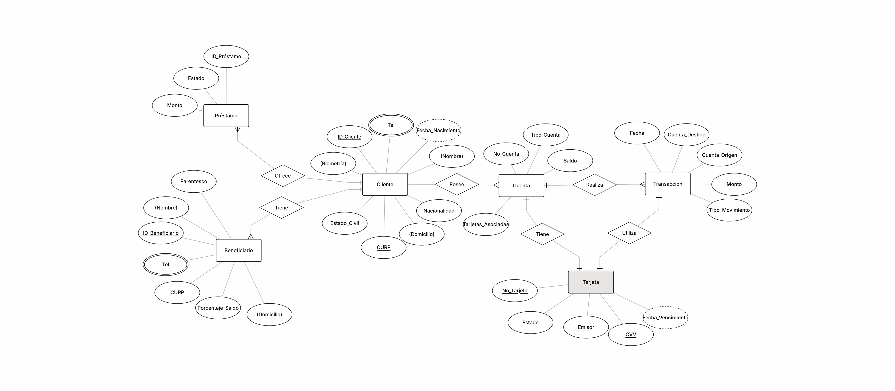
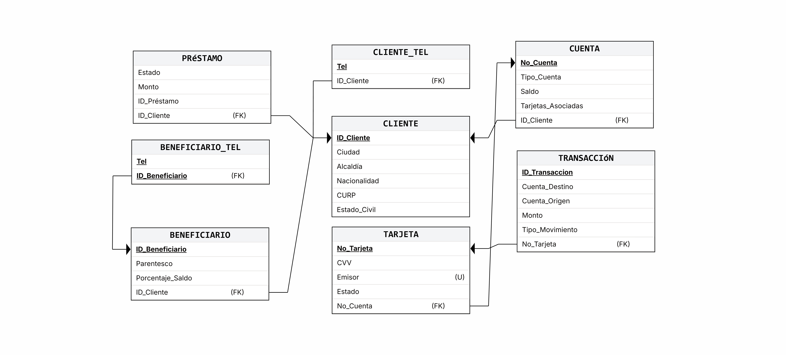

# Fintech DB Simulation & Stress Testing Engine

Este proyecto despliega y automatiza la infraestructura relacional de una plataforma de una fintech mediante PostgreSQL alojado en Docker, coordinado e inyectado con datos  a través de un motor de simulación en Python.

Descripción de la Problemática: Se tiene la necesidad de una plataforma para gestionar cuentas digitales, tarjetas y préstamos. Es necesario poder llevar acabo eficientemente las transacciones y la gestión de la información perteneciente a los clientes.

El diseño está optimizado bajo la Forma Normal de Boyce-Codd (BCNF) para evitar anomalías transaccionales, y cuenta con mecanismos de control internos (*Triggers* y *Procediminetos Almacenados*) encargados de la integridad financiera del sistema.

En esta segunda versión, se decidió migrar el proyecto a un ORM (SQLAlchemy). Los beneficios son los siguientes: 

Escalabilidad, legibilidad, SQLAlchemy se encarga de ir a Docker, apartar los IDs autoincrementales necesarios en la memoria intermedia de Postgres y enlazarlos automáticamente en las relaciones necesarias. Otro punto fuerte es que el código es independiente del motor, SQLAlchemy actúa como un traductor universal, se interactua con objetos de Python y el ORM se encarga de traducir eso al SQL que entienda el contenedor de Docker.

La transición a SQLAlchemy transformó el proyecto de un script de automatización rígido a una aplicación con una mejor arquitectura. Se eliminó el acoplamiento directo con el motor de bases de datos, se centralizó el modelo relacional directamente en Python, logrando tipado seguro, y se optimizó el flujo de integridad referencial mediante el manejo de sesiones y estados (flush/commit), garantizando un pipeline de datos inmune a errores de sintaxis SQL manuales.

-Requerimientos y Restricciones: 

El usuario debe poder registrar datos personales, no puede transferir más saldo del que tiene disponible y debe ser el saldo no negativo.
Un usuario no puede visualizar ni editar información a la que no tiene permiso.
Se debe poder registrar depoósitos, hacer transferencias y retiros.
Cada tarjeta debe estar vinculada a una única cuenta de usuario.

Enlace a la versión previa del proyecto: https://github.com/JoseSanti97/Proyects/tree/main/Proyecto_Fintech

---

## Arquitectura y Tecnologías
* **Motor de Base de Datos:** PostgreSQL 15+ alojado en contenedor Docker.
* **Scripting & Automatización:** Python 3.13.
* **Librerías utilizadas:** `SQLAlchemy y psycopg2-binary` (Conector nativo de alto rendimiento), `Faker` (Generador de datos sintéticos)


## Instalación e Instrucciones

Sigue estos pasos para replicar la simulación en tu entorno local:

1. Levantar la Base de Datos en Docker
Asegúrate de tener Docker activo y ejecuta tu contenedor de PostgreSQL asignándole las credenciales configuradas en tu conexion.py:

Bash

docker run --name "nombre-de-tu-fintech-db" -e POSTGRES_DB=fintech -e POSTGRES_PASSWORD=tu_password -p 5432:5432 -d postgres

2. Instalar Dependencias de Python
Clona el repositorio, accede a la carpeta e instala los paquetes necesarios:

Bash

cd "Carpeta_del_Proyecto"

pip install -r requirements.txt

3. Ejecutar la Automatización Completa
Corre el script principal. Este se encargará de purgar bases previas, compilar la nueva estructura SQL secuencialmente (Tablas -> Restricciones -> Triggers -> Procedures) e iniciar la simulación:

Bash

python main.py

---

## 📁 Estructura del Proyecto

```text
Proyecto_Fintech/
│
├── generador/
│   ├── conexion.py          # Módulo de enlace de red encapsulado para Docker
│   ├── modelos.py           # Definición de las relaciones y tipos de datos en SQLAlchemy
│   └── poblador_masivo.py   # Motor de simulación e inyección de datos (Faker)
│
├── scripts_sql/
│   ├── 01_schema.sql        # Definición de las relaciones con tipos de datos
│   ├── 02_constraints.sql   # Restricciones de integridad referencial, llaves y unicidad 
│   ├── 03_triggers.sql      # Triggers de seguridad (Garantiza saldos mínimos en transferencias)
│   ├── 04_procedures.sql    # Procedimientos almacenados para la lógica bancaria automatizada
│   ├── 05_metrics_queries.sql # Consultas de auditoría, analítica y métricas financieras de negocio
│   ├── 06_escenarios.sql    # Implementación de Roles y Vistas
├── main.py                  # Director del despliegue y automatización
├── requirements.txt         # Dependencias empaquetadas del proyecto
└── README.md                # Documentación

```

##  Modelado del Negocio
<details>

  <summary>Haz clic aquí para ver el Modelo Entidad-Relación (E-R)</summary>
  <br>
  <p align="center">
    
  </p>
</details>

<details>
  <summary>Haz clic aquí para ver el Modelo Relacional</summary>
  <br>
  <p align="center">
    
  </p>
</details>

---

## Normalización de la Base de Datos

1. Primera Forma Normal (1NF)

En el diseño original, un CLIENTE o un BENEFICIARIO pueden tener uno más teléfonos. Así, se crearon las tablas CLIENTE_TEL y BENEFICIARIO_TEL
De esta forma los clientes y los beneficiarios pueden tener uno o más npumeros de teléfono, haciendo cada registro atómico y cumpliendo así 1NF.

2. Segunda Forma Normal (2NF)

Las tablas asociativas como CLIENTE_TEL o BENEFICIARIO_TEL manejan llaves compuestas. Al separar los datos del usuario(CLIENTE) en distintas tablas,
y no tener dependencias parciales, garantizamos estar en 2NF.

3. Tercera Forma Normal (3NF)

Dejamos en CUENTA únicamente lo que le pertenece al producto financiero, y los datos personales están en CLIENTE. La única conexión que dejamos fue el ID_Cliente 
como FK. En el resto de tablas los datos dependen estrictamente de su respectivo ID autoincrementable. El hecho de que tengan un ID_Cliente como Llave Foránea es válido, ya que es el conector referencial, por lo que también estamos en 3NF

4. BCNF

Para la tabla CLIENTE:

La dependencia funcional 1 es ID_Cliente, como es la PK Y es una superllave, entonces cumple con NFBC. 
Dado que ID_Cliente y CURP son llaves válidas para identificar al cliente, la tabla CLIENTE está estrictamente en NFBC.

Las tablas CLIENTE_TEL y BENEFICIARIO_TEL al estar conformadas únicamente por las columnas de sus llaves compuestas (Tel, ID_Cliente) y (Tel, ID_Beneficiario), no existen otras dependencias funcionales externas u ocultas que rompan la regla. La superllave es la combinación completa de ambos datos. Por todo esto, la base de 
datos está en BCNF. 
